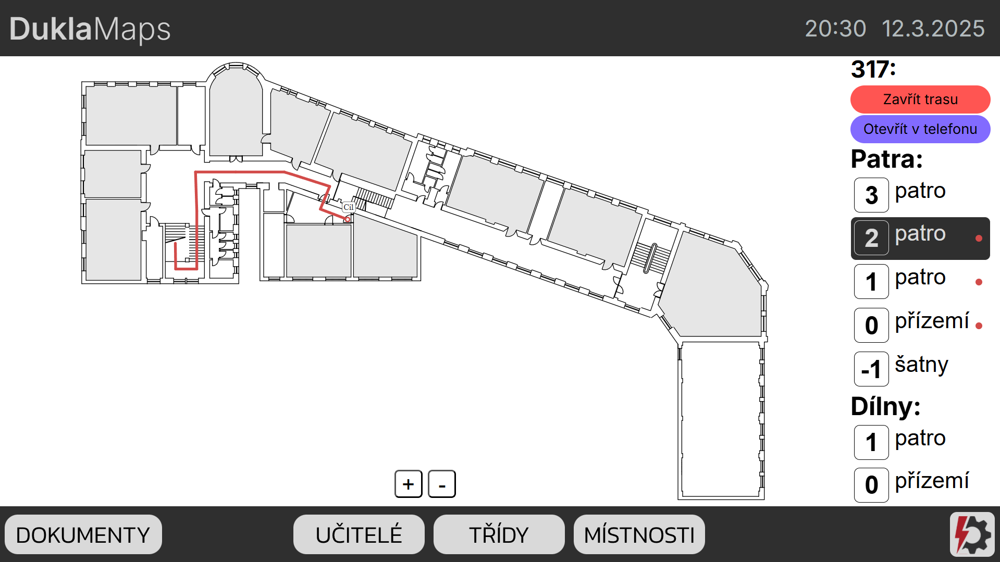
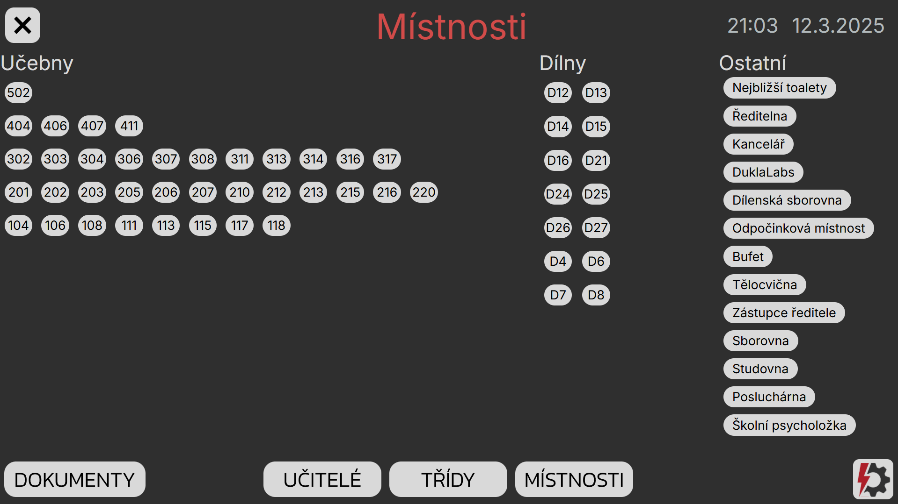
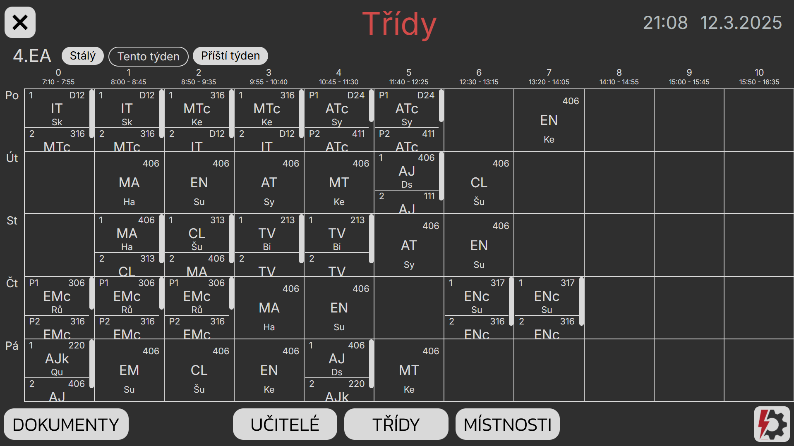

# DuklaMaps
Projekt interaktivní mapy školy vytvořený jako součást maturitní práce.

Rozhraní umožňuje navigaci po budově a zobrazení aktuálních informací o rozvrhu.

Použité technologie: 
HTML, CSS, JavaScript, Python, Flask 

Projekt je spravován členy DuklaLabs. Pro více info: www.labs.spssecb.cz

## Ukázka rozhraní:

 
 

## Instalace:
**Požadavky**: Python (doporučená verze: 3.11.9), internetový prohlížeč

1. Nainstalujte potřebné knihovny příkazem `pip install -r requirements.txt`
2. Příkazem `python getTimetableData.py` získáte aktuální rozvrhová data. Stahování může trvat několik minut. Můžete případně rozbalit soubor `timetableData.zip`, kde ovšem nejsou aktuální data.
3. Pokud chcete používat funkci otevření trasy na telefonu z QR kódu, otevřete `static/script.js`. Nahoře naleznete proměnnou `serverURL`. Její hodnotu změňte na IP adresu vašeho zařízení, nezapomeňte uvést port `5000`, používaný flaskem.
4.	Server spustíte příkazem `python app.py`.